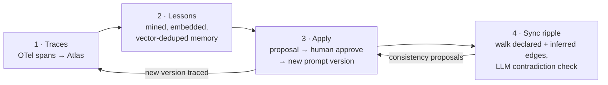

# überprompt

**Your prompts are a team. überprompt keeps them semantically in sync.**

Prompts in a real AI product are a distributed system: shared tone-of-voice
fragments, duplicated policy rules, agents whose prompts must agree with each
other. Change one and the others silently drift — and nobody closes the loop from
production traces back into prompt improvements; it's all manual. überprompt
ingests OpenTelemetry traces into MongoDB Atlas, mines them into durable
**lessons** (the agent's persistent, embedded memory), turns lessons into
reviewable prompt-edit **proposals**, and — after every approved version bump —
ripples a **semantic sync check** through the prompt dependency graph, including
dependencies nobody declared, discovered by vector similarity.

Built for the MongoDB **Persistent Context Sprint** (Build Fest, Aug 13 2026).

## The loop



1. **Traces** — apps call LLMs through the SDK (`registerUberprompt()`) or POST
   OTLP from any language to `uberprompt collect`; spans land in Mongo and roll
   up into per-call traces, stamped with the exact prompt name + version + hash.
2. **Lessons** — an analyzer mines trace batches into lessons ("never promise a
   refund amount before verifying charges"), embedded and vector-deduped against
   existing memory. Knowledge, not yet action.
3. **Apply** — `uberprompt propose` targets each lesson at the prompts it applies
   to (lineage → LLM catalog pass → vector RAG over prompt-purpose embeddings)
   and files minimal-edit proposals; an eval gate replays real traces
   pairwise-judged against a golden set. A human approves the diff → version
   bump, immutable snapshot, re-embed.
4. **Sync ripple** — every bump triggers `uberprompt sync-check`: walk the
   dependency graph for everything that depends on the changed fragment
   (declared `uses` edges plus inferred `semantic` edges), LLM-check each
   dependent for contradiction, and file consistency proposals. Waves shrink
   until the graph is quiet. Automatic vector discovery of *new* undeclared
   edges at sync time is the loop's final piece, landing in a parallel PR —
   today `uberprompt infer` finds them and `sync-check` walks them.

## MongoDB-native — the DB is the agent's memory and nervous system

One platform, zero bolt-ons:

- **Documents + append-only versioning** — `prompts` holds the current version;
  every change freezes an immutable `prompt_versions` snapshot with a
  content-addressed `contentHash` (sha256 of template + sorted fragments), so
  re-running a definition never phantom-bumps and every trace pins the exact
  prompt content that produced it.
- **3 Atlas Vector Search indexes** (Voyage `voyage-3.5-lite`, 1024d, cosine):
  fragment texts, lesson memory, and prompt-purpose descriptions — powering
  undeclared-dependency discovery, lesson dedup, and lesson→prompt targeting.
  Compound `filter` fields scope searches to active lessons / specific prompts.
- **Change streams as the event bus** — the stage-3 agent tails `lessons` with
  resume tokens persisted in Mongo (`sync_state`), so restarts continue exactly
  where they left off; `uberprompt tail` streams traces live the same way.
- **`$graphLookup`** for transitive dependent walks, **`$merge`** for the
  idempotent spans→traces rollup, **`$jsonSchema` validators** (strict, error),
  **TTL indexes** on telemetry, **wildcard indexes** over raw OTel attributes.

## A real run (verified against the live cluster)

From [docs/PIPELINE-TEST.md](docs/PIPELINE-TEST.md), an end-to-end pass with
real command output: traces from a support crew produced the lesson *"never
promise a refund amount before verifying charges"* (from `billing-agent`
traces, extended to `escalation-writer` by the targeting ladder) and *"route to
escalation whenever the customer mentions lawyers, legal action, or a
regulator"* (from `triage-router`, extended to `tech-support-agent`).
`uberprompt proposals` showed both diffs; approving the second bumped
**tech-support-agent v1 → v2** — snapshot frozen, fragment re-embedded,
one new sentence in the task text — and `uberprompt sync-check
tech-support-agent` then LLM-verified the neighboring escalation rules still
agree, terminating with "graph is quiet".

## Quickstart

Env (`cp .env.example .env`): `MONGODB_URI` (Atlas), `MONGODB_DB`,
`OPENAI_API_KEY` (LLM calls), `VOYAGE_API_KEY` (embeddings).

```sh
pnpm install --config.minimum-release-age=0   # ai@7 is younger than pnpm's 24h default
pnpm --filter @uberprompt/sdk create-indexes  # collections, validators, vector indexes
pnpm --filter @uberprompt/sdk seed-demo       # Mango Republic demo crew + seed traces
```

Then run the loop with the CLI (`uberprompt help` for everything):

```sh
uberprompt init                    # trace-ingestion collections + indexes
uberprompt collect                 # OTLP/HTTP receiver on :4318 — any language
uberprompt tail                    # stream traces live via a change stream
uberprompt graph                   # the prompt dependency graph, rendered
uberprompt affected <node>         # blast radius of a prompt/fragment change
uberprompt infer --apply           # vector+LLM discovery of undeclared semantic edges
uberprompt propose                 # lessons → targeted minimal-edit proposals
uberprompt proposals               # review pending diffs
uberprompt approve <id>            # snapshot, rewrite, bump version, re-embed
uberprompt sync-check <prompt>     # ripple the change through the graph
uberprompt compare <prompt>        # did the new version actually help? (per-version stats)
```

### Installing the CLI on your PATH

One command, from the repo root:

```sh
cd packages/cli && npm link
```

That symlinks `uberprompt` onto your PATH (and installs its one dependency).
Because it is a symlink into your checkout, every `git pull` updates the CLI
automatically — no reinstall. Run it from anywhere inside the repo (it finds
`apps/demo` via git). If a later pull adds a new dependency to
`packages/cli/package.json`, run `npm install` there once. Prefer a fixed copy
instead of the live symlink? `npm i -g ./packages/cli`.

## Read more

- [docs/IDEA.md](docs/IDEA.md) — the full architecture, data model contract, and
  the MongoDB features behind each stage.
- [docs/PIPELINE-TEST.md](docs/PIPELINE-TEST.md) — the live end-to-end pipeline
  run, with real numbers and the honest list of what's still rough.
- [packages/cli/README.md](packages/cli/README.md) — CLI details + the
  raise-escalation-threshold walkthrough.
- [apps/demo/README.md](apps/demo/README.md) — the Mango Republic demo crew and
  its deliberately planted undeclared dependencies.
